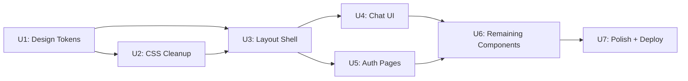

# Unit 00: Overview — Perplexity Design Overhaul

> Each unit is **independently testable** and must pass its gate before the next unit begins.
> No unit is time-boxed — it's done when the compliance tests pass.

## Goal

Transform ShopMeta from Supabase dark-first emerald theme → Perplexity light-first teal theme.

| Before | After |
|--------|-------|
| Dark `#171717` background | White `#ffffff` background |
| Emerald `#3ecf8e` accent | Teal `#21808D` accent |
| System fonts | Inter + JetBrains Mono (SIL OFL 1.1) |
| Left-aligned chat | Centered search-first (720px column) |
| Drop shadows, gradients | Flat surfaces, border contrast |

## Compliance Test Suite

```
shopmeta/tests/unit/design/perplexity-compliance.test.ts
```

57 tests across 3 layers:
- **L1:** Token presence (light + dark colors, typography, spacing, radius, layout, motion)
- **L2:** Anti-pattern detection (gradients, shadows, uppercase, old colors, emoji)
- **L3:** Component source audit (Thread, Composer, Sidebar, Auth, fonts)

## Unit Dependency Graph



## Unit Index

| # | Unit | Depends on | Tests | Status |
|---|------|-----------|-------|--------|
| 01 | [Design Tokens + Typography](01-design-tokens.md) | — | 32 | ⬜ |
| 02 | [CSS Anti-Pattern Cleanup](02-css-cleanup.md) | U1 | 8 | ⬜ |
| 03 | [Layout Shell + Sidebar](03-layout-sidebar.md) | U1, U2 | 4 | ⬜ |
| 04 | [Chat UI Components](04-chat-ui.md) | U3 | 9 | ⬜ |
| 05 | [Auth Pages](05-auth-pages.md) | U3 | 4 | ⬜ |
| 06 | [Remaining Components](06-remaining-components.md) | U4, U5 | 2 | ⬜ |
| 07 | [Polish + Deploy](07-polish-deploy.md) | U6 | 57 (full) | ⬜ |

## Test Commands

```bash
# Run design compliance tests only
pnpm vitest run --config vitest.config.ts tests/unit/design/

# Run by layer
pnpm vitest run --config vitest.config.ts tests/unit/design/ -t "L1:"
pnpm vitest run --config vitest.config.ts tests/unit/design/ -t "L2:"
pnpm vitest run --config vitest.config.ts tests/unit/design/ -t "L3:"

# Run all existing tests (must not regress)
pnpm test:unit        # 188+ unit tests
pnpm test:component   # 332 component tests
```

## Current Baseline

| Suite | Count | Status |
|-------|-------|--------|
| Design compliance | 20/57 pass | 35% — starting point |
| Unit tests | 188/188 pass | ✅ Must not regress |
| Component tests | 332/332 pass | ✅ Must not regress |
